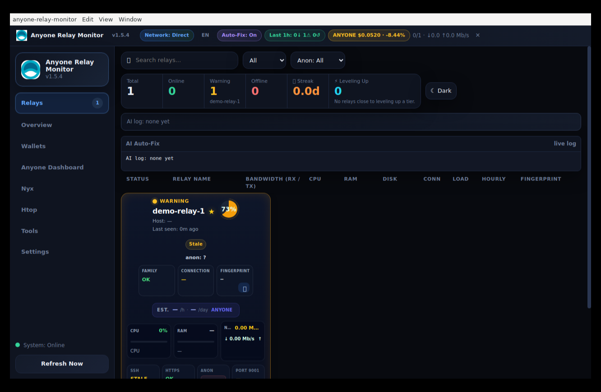
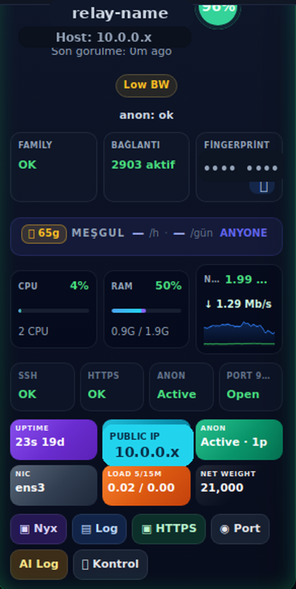

<h1 align="center">RelayPulse</h1>

  <strong>Stop SSH-ing into every relay just to check if it's alive.</strong> 
  Real-time monitoring, automatic fixes and reward tracking for Anyone Protocol relay
  and exit node operators — your whole fleet, from one dashboard.

  <a href="https://github.com/barisadiy1974-hub/relaypulse/releases/latest">Download</a> ·
  <a href="GUIDE.md">User Guide</a> ·
  <a href="https://barisadiy1974-hub.github.io/relaypulse">Website</a>

  

---

## Why

Running one relay is easy. Running thirty is a different job: you end up with a terminal
full of SSH sessions, no idea which box quietly stopped earning last night, and a
`MyFamily` line that drifts out of date every time you add a node.

RelayPulse puts the whole fleet in one window and tells you when something is actually
wrong — not just when a box stops pinging.

## What it does

**Live monitoring** — CPU, RAM, disk, bandwidth, active connections and `anon` service
state, polled per relay. Flap dampening means a single blip doesn't light everything up
red; a relay has to fail twice before it's called offline.

**Health that goes deeper than "is it up"** — checks whether the `anon` service is
actually active, whether the ORPort is reachable from outside, and whether the relay is
carrying traffic. A box can be online and still be earning nothing; RelayPulse tells the
difference.

**Auto-fix** — when a relay goes offline or its service dies, the app can diagnose the
error and run a remediation command on its own. It deliberately refuses to act on SSH
credential or host-key errors, where a blind retry would do more harm than good.

**Network weight** — pulls each relay's consensus weight and observed bandwidth straight
from the Anyone network, so you can see how the network rates your relay without
touching the box.

**MyFamily automation** — collects fingerprints across the fleet and writes a correct,
up-to-date `MyFamily` line to every relay in one click.

**Reward tracking** — per-relay ANYONE earnings, plus a detector that flags relays
earning below the fleet median while their bandwidth and uptime look normal.

**Built-in tooling** — `anonrc` editor, Nyx and log access one click away per relay, and
bulk fail2ban / SSH-exposure checks across the fleet.

  

<em>One relay card — identifying details redacted.</em>

## Download

| Platform | Format |
| --- | --- |
| Windows (x64) | Portable `.exe`, no install |
| Linux (x64) | AppImage |
| Linux (ARM64) | AppImage — Raspberry Pi and ARM servers |

Grab the latest build from the [Releases page](https://github.com/barisadiy1974-hub/relaypulse/releases/latest).

The ARM64 build runs headless on a Raspberry Pi — pair it with Xvfb and noVNC and you
have a monitoring box you can reach from any browser on your network.

## Requirements

- SSH access to your relays (key-based), or the Anyone HTTPS agent running on them
- Nothing installed on the relays themselves — RelayPulse reads what's already there

## Trial and licence

Free 14-day trial, no account needed. After that a licence key unlocks it; the check is
offline, so the app never phones home about who you are or what you run.

## Support

Questions, bugs or licence issues: **baris.adiy1974@gmail.com**

## Disclaimer

RelayPulse is an independent tool built by a relay operator, for relay operators. It is
**not affiliated with, endorsed by, or supported by the Anyone Protocol project**.

This repository hosts the website and release binaries. The application source is closed.
